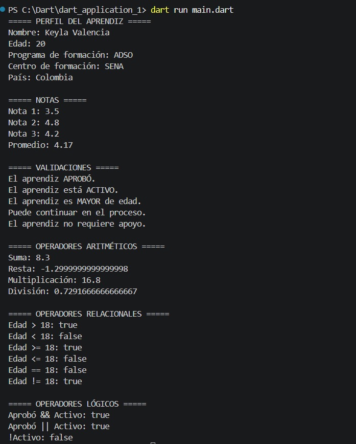

# Información del Aprendiz

* **Nombre:** Hannah Molina Valencia
* **Ficha:** 3256538
* **Programa:** ADSO

## Descripción

Este proyecto lo hice en Dart con el objetivo de practicar los conceptos básicos del lenguaje. El programa registra la información de un aprendiz, como el nombre, la edad, el programa y el centro de formación. También permite ingresar tres notas para calcular el promedio y, con esos datos, determina si el aprendiz aprobó, si es mayor de edad, si está activo, si puede continuar con su proceso de formación y si necesita apoyo. Finalmente, muestra toda la información y los resultados en la consola de una forma clara y organizada.

## Objetivo

Desarrollar un programa en Dart que registre la información básica de un aprendiz, calcule el promedio de sus notas y realice varias validaciones sobre su estado académico. Esto aplicará conceptos fundamentales del lenguaje, como variables, tipos de datos, operadores, estructuras condicionales, comentarios y salida de información en la consola.

## Temas trabajados

* Variables (`var`, `final`, `const`).
* Tipos de datos (`String`, `int`, `double`, `bool`).
* Operadores aritméticos, relacionales y lógicos.
* Estructuras condicionales (`if` y `else`).
* Comentarios de una línea y de varias líneas.
* Cálculo de promedios.
* Validación de información.
* Salida de datos en consola con `print()`.

## Instrucciones para ejecutar el programa

1. Instalar Flutter y la extensión **Dart** en Visual Studio Code.
2. Crear un nuevo proyecto **Console Application** con `Dart: New Project`.
3. Abrir el archivo `main.dart` (o el archivo principal dentro de `bin`).
4. Pegar el código de la actividad.
5. Ejecutar el programa con **F5** o haciendo clic en **Run**.
6. Verificar los resultados en la **Debug Console**.

## Evidencia de ejecución

* Los datos del aprendiz.
* Las tres notas registradas.
* El promedio calculated.
* Las validaciones realizadas (aprobó, mayor de edad, activo, puede continuar y requiere apoyo).

## Preguntas de reflexión

1. ¿Qué aprendí sobre el uso de variables y tipos de datos en Dart?
Aprendí que las variables sirven para guardar información y que cada tipo de dato tiene un uso diferente, como texto, números o valores de verdadero y falso.

2. ¿Por qué es importante utilizar operadores lógicos y relacionales en un programa?
Porque ayudan a comparar datos y a tomar decisiones, por ejemplo, saber si un aprendiz aprobó o si puede continuar en el proceso.

3. ¿Qué dificultades encontré durante el desarrollo y cómo las solucioné?
Al principio tuve algunas dudas con la sintaxis de Dart y con las validaciones, pero leyendo los errores, practicando y haciendo pruebas pude corregir el código hasta que funcionó correctamente.

## Conclusión de la actividad

Con esta actividad aprendí a declarar diferentes tipos de variables, utilizar operadores para realizar cálculos y comparaciones, y emplear estructuras condicionales para tomar decisiones según los datos ingresados. Además, comprendí la importancia de escribir un código organizado y comentado para facilitar su comprensión y mantenimiento.